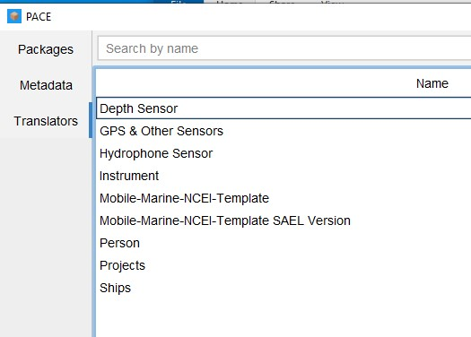

# NCEI-PACE-DATA-Archive

Repository for methods and scripts for archiving SWFSC Southwest Acoustic Ecology Lab's passive acoustic data to NCEI using the [Passive Acoustic Collection Engine (PACE)](https://github.com/CI-CMG/pace) These methods assume you have some familiarity with PACE or the NCEI/Passive Packer packaging process, and are specific to SWFSC SAEL - CalCurCEAS 2024 dataset. Please modify as necessary if adopting these methods for your own data. This is for packaging and archiving raw audio data only. We are not packaging any data products, but similar methods can be followed if doing so.

PACE uses translators to easily transfer your metadata spreadsheets and raw data to standardized data packages. The following methods outline how the Southwest Acoustic Ecology lab built custom translators and packaged data from CalCurCEAS 2024 for archive. These translators were built specifically for our metadata spreadsheet (Deployment Details) and inventory but these methods can be easily adopted for other metadata formats.

## Scripts included in this repo

### Translators

PACE uses 'Translators' to map your deployment metadata spreadsheet columns to NCEI required fields. The [Translators.Rmd script](https://github.com/Kourtney-Burger/NCEI-PACE-Data-Archive/blob/da65fc29a2e46141cc7bdf946379be2b06f3a4e8/R/R%20Scripts/Translators.Rmd) is used to create custom metadata spreadsheets (built from Deployment Details or inventory sheets), which can be imported into PACE to create Translators specific to your project. This includes all non-deployment specific metadata (projects, people, organizations, instruments, sensors, and ships). Deployment specific metadata (for Audio Packages) will be prepared using the AudioPackage.rmd

Run this code (or change it to match your metadata source) and save all of the new metadata spreadsheets. Once your spreadsheets are created, you can use PACE to create translators specific to your data.

To use the same translators developed for SAEL CalCurCEAS data, download the json files here (INSERT LINK TO TRANSLATOR FOLDER) and save them to your local PACE folder (\~.pace\data\translators). You should then be able to see the translators in PACE

### Audio Package

The AudioPackage.rmd script is for preparing and packaging all deployment specific metadata (audio packages). This uses PACE's Mobile Marine template as a base for creating the spreadsheet, and a modified version of PACE's Mobile Marine translator (titled Mobile-Marine-NCEI-Template SAEL Version).

This script will read in metadata from the deployment details spreadsheet and will tidy it to spreadsheet ready to be translated into packages in PACE.

### Data Transfer

The DataTransfer.Rmd script helps prepare and transfer the raw data for packaging. To speed up the packaging process, CalCurCEAS data was copied from its original storage location (local servers) and reorganized on an external drive. This script automates the file transfer process and creates new paths for your Audio Packages.

## Archive Steps

### Download PACE

Follow the directions on the [PACE repository README](https://github.com/CI-CMG/pace#) to complete the GUI installation.

Note: To use the same translators developed for SAEL CalCurCEAS data, download the json files here (INSERT LINK TO TRANSLATOR FOLDER) and save them to your local PACE folder (\~.pace\data\translators).

### Prepare your data for archive

Note: When running the following scripts, review each one and update any paths or specific metadata as needed. As mentioned above, these methods are specific to SWFSC Southwest Acoustic Ecology Lab - CalCurCEAS dataset and will need to be modified if adopting them to your own data.

1.  Copy this repository and create a new R project for your version
2.  Download 'Deployment Details - NEW DEPLOYMENT TO SAVE' sheet to package new data (need to replace the version that is stored in this repo as it may be outdated)
3.  Run the DataTransfer.rmd script to prepare all of your raw data paths for packaging. Take note to update any paths or specific metadata as needed. Note: This may take a while to transfer raw data depending on the size of your deployment, see the progress bar in each section for transfer status.
4.  Run the AudioPackage.rmd script for your deployments that need to be packaged. Take note to update any paths or specific metadata as needed
5.  Run the Translators.Rmd code to create your metadata spreadsheets. Take note to update any paths or specific metadata as needed
6.  Open PACE GUI and use the Translators tab to create new ones or use SAEL/CalCurCEAS specific ones
    -   If recreating new translators, follow the directions in the [PACE documentation](https://github.com/CI-CMG/pace/blob/6f1901f476278814289296a4ec7c420f860d019e/docs/PACE%20GUI%20Guide.pdf)
    -   If using SAEL translators, make sure they are saved to your local PACE folder (methods here). Each translator should already mapped the fields from each spreadsheet created in the Translators.Rmd to the PACE fields
7.  Click on the Metadata tab in PACE and Translate your metadata for each type/tab at the top of the window
    -   Project example: Click on 'Projects' tab and select 'Translate'
    -   In the new window select the 'Projects' translator from the first dropdown
    -   Click on 'Choose File' and select your 'Projects.xlsx' file
    -   Click the 'Translate' button and any projects not already saved in PACE should show up in the 'Projects' tab of the main PACE GUI
    -   A new window will popup if there are any errors in the translation process
8.  Complete step 5 for all other metadata types to ensure any overlapping metadata you include in your audio package is included here
9.  Once all the metadata is saved, you are ready to package your audio data. If using the same metadata format as SAEL, you can use the 'Mobile-Marine-NCEI-Template SAEL Version' translator (should already be accessible in PACE if you copied the translators in step 6). See PACE's other templates or build your own translator if you are using a different metadata type.
10. In PACE, go to the 'Packages' tab and click 'Translate'
11. Select your translator and choose the spreadsheet you created in step 4
12. Click the 'Translate' button again and all packages should load into the PACE window. A pop up window will show any translation errors.
13. When you are ready to package, select your deployments (click on the check box under 'Select for Packaging') and click 'Package Data'. You can select multiple to bulk package
14. Select a directory and click 'Submit' to start the packaging process.
15. The packaged datasets in the directory you chose should now be ready to be sent to NCEI, double check that all of the necessary data files were included (e.g. audio, temp, navigation files, etc.)

# Need help? 

-   See [PACE repository](https://github.com/CI-CMG/pace) and [documentation](https://github.com/CI-CMG/pace/blob/6f1901f476278814289296a4ec7c420f860d019e/docs/PACE%20GUI%20Guide.pdf)

-   Make a new issue in this repository and tag/assign Kourtney-Burger

-   Contact Kourtney Burger with any addition questions (kourtney.burger\@noaa.gov)
